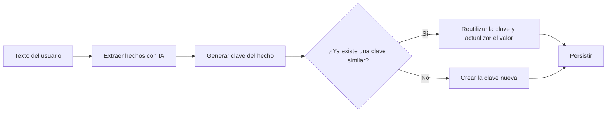

# Proyecto IAA 2026

Repositorio para el proyecto de la materia IAA (2026).

## Estructura

- `/eval/`: Evaluación de sistemas de memoria existentes.
- `/src/agente_mem_propio/`: Sistema de memoria propio.
- `/demo/`: Scripts de demostración.
- `/docs/`: Documentación/fuentes utilizadas.

## Evaluación de sistemas de memoria existentes

TODO.

## agente_mem_propio

Sistema de memoria que guarda los datos que un usuario menciona en una conversación (correo, ciudad, empleo, preferencias, etc.) y evita duplicados cuando la misma información se repite con otras palabras.

### Instalación

Para instalar el paquete, en la terminal, estando en el directorio base de este repositorio, correr:

```bash
# Core system only (for production)
pip install -e .

# Core + evaluation harness dependencies
pip install -e .[eval]
```

### Cómo funciona

El sistema tiene tres piezas que colaboran en cadena:

1. **Extraer** — Un modelo de lenguaje lee el texto del usuario e identifica los hechos relevantes, clasificándolos en categorías fijas (correo, ubicación, teléfono, empleo, nombre, preferencia…).
2. **Guardar** — Cada hecho se almacena bajo una clave estructurada que combina *quién*, *qué tipo de dato* y *qué categoría* (por ejemplo, el correo del usuario `user_123`).
3. **Deduplicar** — Antes de guardar, el sistema comprueba si ya existe una clave con un significado parecido. Si la encuentra, reutiliza la existente y actualiza su valor en lugar de crear una nueva.



En vez de comparar claves letra a letra, el sistema las convierte en **vectores numéricos (embeddings)** que capturan su significado y mide la **similitud por coseno** entre ellos. Si dos claves son lo bastante parecidas en significado, se consideran la misma y se funden en una sola. Así, "vivo en Madrid" y "mi ciudad es Madrid" acaban en una única entrada, sin importar cómo se formule la frase.

### Persistencia

- Los datos se guardan en un archivo **JSON**, junto con la fecha de la última actualización de cada entrada.
- El índice de claves (los embeddings) se guarda en **ChromaDB**, de modo que la memoria sobrevive entre ejecuciones.
